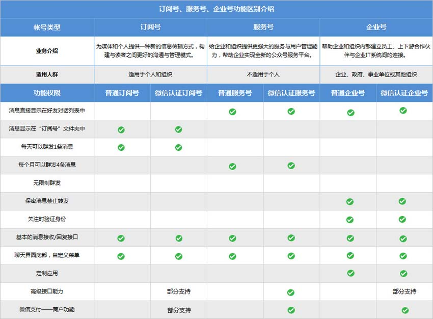

# 微信公众平台

#### 微信公众平台，简称公众号，公众号包含服务号、订阅号、小程序、企业微信四种类型


```html
1、订阅号：主要偏于为用户传达资讯（类似报纸杂志），认证前后都是每天只可以群发一条消息；
2、服务号：主要偏于服务交互（类似银行，114，提供服务查询），认证前后都是每个月可群发4条消息；
3、企业号：主要用于公司内部通讯使用，需要先验证身份才可以关注成功企业号。

温馨提示：
1）如果想简单的发送消息，达到宣传效果，建议可选择订阅号；
2）如果想用公众号获得更多的功能，例如开通微信支付，建议可以选择服务号；
3）如果想用来管理内部企业员工、团队，对内使用，可申请企业号；
4）订阅号不支持变更为服务号，同样，服务号也不可变更成订阅号。
```

